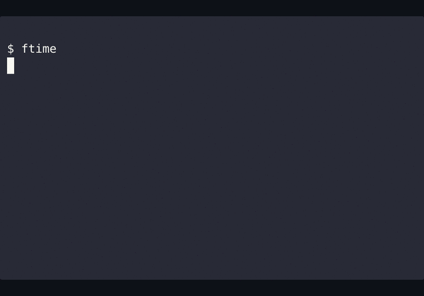

# ftime — シンプルなファイル時刻ビューア

ファイルの「更新時刻」「作成時刻」「名前」を一覧表示する小さなCLIです。

<p align="left">
  
  
</p>

初学者や非ネイティブにも読みやすい設計。わかりやすいエラーメッセージと初心者向けヘルプを備えています。

| 列       | 意味                                                                                         |
|----------|----------------------------------------------------------------------------------------------|
| mark     | 更新フラグです（1文字）。`+` は「作成後に更新があった」ことを示します。色分けが有効な場合は黄色で表示されます。 |
| modified | 最終更新時刻（`MM-DD HH:MM`）                                                                |
| created  | 作成時刻（経過時間で色分け。未対応時は `-`）                                              |
| name     | ファイル/ディレクトリ名（色有効時、拡張子や種別で色分け）                                    |

---

## 必要要件

- GNU coreutils: `stat`, `date`
- GNU findutils（`-printf`/`-print0` を備えた `find`）と GNU `sort`（`-z` 対応）
- Bash シェル（`#!/usr/bin/env bash`）

macOS向けメモ:
- Homebrew などで GNU ツールを導入すれば動作します。
  ```bash
  brew install coreutils findutils   # gstat/gdate/gfind/gsort を提供
  ```
  スクリプトは `gstat/gdate/gfind/gsort` を自動検出し、GNU がデフォルトの環境では `stat/date/find/sort` を使います。

---

## インストール（ワンライナー: ダウンロードのみ） – 推奨

リポジトリをクローンする必要はありません。スクリプトをダウンロードして実行権限を付与します。

```bash
mkdir -p ~/.local/bin
curl -fsSL https://raw.githubusercontent.com/tsutomu-n/ftime/main/ftime-list.sh \
  -o ~/.local/bin/ftime
chmod +x ~/.local/bin/ftime

# test
hash -r
ftime --help
```

### アンインストール

```bash
rm ~/.local/bin/ftime
```

---

<details>
  <summary><strong>インストール（リポジトリから） – 任意</strong></summary>

`~/.local/bin` にシンボリックリンクを置いて `ftime` コマンドとして利用します。

1) 任意の場所へクローン

```bash
git clone https://github.com/tsutomu-n/ftime.git
cd ftime   # リポジトリルートへ
```

2) 実行権限を付与

```bash
chmod +x ftime-list.sh
```

3) `~/.local/bin` を PATH に含める（zsh/bash を自動判定。rc が無ければ作成）

```bash
if [ -n "$ZSH_VERSION" ]; then
  rc="${ZDOTDIR:-$HOME}/.zshrc"
elif [ -n "$BASH_VERSION" ]; then
  rc="$HOME/.bashrc"
else
  rc="$HOME/.profile"
fi
mkdir -p "$(dirname "$rc")"
grep -q '\\.local/bin' "$rc" 2>/dev/null || \
  echo 'export PATH="$HOME/.local/bin:$PATH"' >> "$rc"
. "$rc"
```

4) `ftime` というコマンドを作成

```bash
mkdir -p ~/.local/bin
ln -sf "$PWD/ftime-list.sh" ~/.local/bin/ftime
```

5) リフレッシュして確認

```bash
hash -r
ftime --help
```

</details>

**注意**

- シェルが `ftime` を見つけない場合は新しいターミナルを開くか、`source ~/.zshrc` を実行してください。
- このツールは Linux の GNU `stat`/`date` と Bash を必要とします。

---

## 使い方

### クイックスタート

```bash
ftime               # カレントディレクトリを一覧
ftime -a            # 絶対時刻の代わりに相対時間を表示
ftime -s time       # 更新時刻でソート（新しい順）
ftime -R -d 2 md    # 深さ2で再帰し *.md を一覧
ftime --git-only    # 現在のgitリポジトリで変更/ステージ/未追跡のみを表示
ftime --help        # 詳細ヘルプ
ftime --help-short  # 短いヘルプ（3行）
ftime --version     # バージョン表示
```

### 書式

```bash
ftime [DIR] [PATTERN ...]
```

- DIR（任意）: スキャンするディレクトリ。デフォルトはカレントディレクトリです。
- PATTERN（任意・OR条件）:
  - `*` または `?` を含む → そのままグロブとして使用
  - `.` で始まる → `*` を前置（例: `.log` → `*.log`）
  - 上記以外 → 拡張子扱い（例: `md` → `*.md`）

### オプション

- `-a, --age`: 絶対時刻の代わりに相対時間を表示（例: `5m`, `3h`）
- `-s, --sort time|name`: ソートキー（デフォルト: name、`time` は更新時刻）
- `-r, --reverse`: ソート順を反転
- `-R, --recursive`: サブディレクトリを再帰的に走査
- `-d, --max-depth N`: 再帰の深さを N に制限（`-R` が必要）
- `--git-only`: 現在のgitリポジトリで変更/ステージ/未追跡のみを表示（リポジトリ外では全件にフォールバック）
- `-h, --help`: 詳細ヘルプを表示
- `--help-short`: 短いヘルプを表示
- `-V, --version`: バージョンを表示

### 例（組み合わせ）

```bash
# ツリー全体を再帰（大きくなる可能性あり）
ftime -R

# 深さ3で再帰
ftime -R -d 3

# docs/ 配下を深さ2、*.md のみ
ftime -R -d 2 docs md

# 更新時刻でソートし、1階層だけ再帰
ftime -s time -R -d 1

# 更新時刻の昇順（古い順）でツリー全体
ftime -s time -r -R
```

### よくあるつまずき

- `-d` には数値が必要
  ```bash
  ftime -d          # Error: --max-depth expects a positive integer
  ftime -d -R       # Error: --max-depth expects a positive integer
  ftime -R -d 3     # OK
  ftime -d 3 -R     # OK（オプション順は任意）
  ```

- `-d` を使うときは `-R` も指定
  ```bash
  ftime -d 3        # Error: --max-depth requires --recursive (-R)
  ftime -R -d 3     # OK
  ```

- シェル展開を避けるためにパターンはクォート
  ```bash
  ftime '*.md'      # OK: パターンは ftime がフィルタとして扱う
  ftime *.md        # シェルがファイル名へ展開し、意図通りでない場合あり
  ```

- 深さは起点の DIR 基準
  ```bash
  ftime -R -d 1 docs   # docs/ と直下のみ（孫以降は含まない）
  ```

- ベース名のみでフィルタ
  パターンはファイル名（ベース名）のみに適用されます（ディレクトリ名には一致しません）。`docs/*.md` のようなパス指定は `-R` と `md`/`*.md` を併用してください。

----

**Notes**
- 優先順位: コマンドラインオプション > 環境変数 > デフォルト

タイムゾーン: デフォルトはマシンのローカル。環境変数 `FTL_TZ` で上書き可（例: `FTL_TZ=Asia/Tokyo ftime md`）。

### Git-only の詳細

Git のポーセリンに優しいプランビングを使い、ヌル区切りで安全に処理します:

- 作業ツリーで変更: `git -C "$dir" ls-files -z -m --`
- ステージ済みの変更: `git -C "$dir" diff --name-only -z --cached --`
- 未追跡（無視規則を尊重）: `git -C "$dir" ls-files -z -o --exclude-standard --`

サブディレクトリから実行した場合も、パスは正しくマッピングされます。

### 設定ファイル（XDG）

- パス: `$XDG_CONFIG_HOME/ftime/config` または `~/.config/ftime/config`
- 形式: `KEY=VALUE` のシンプルな行。未知のキーは安全のため無視します。
- 許可キー: `FTL_TZ`, `FTL_FORCE_COLOR`, `FTL_NO_COLOR`, `FTL_NO_TIME_COLOR`, `FTL_ACTIVE_HOURS`, `FTL_RECENT_HOURS`
- 優先順位: コマンドライン > 環境変数 > 設定ファイル > デフォルト

例 `~/.config/ftime/config`:

```ini
FTL_TZ=UTC
FTL_ACTIVE_HOURS=4
FTL_RECENT_HOURS=24
```

<details>
  <summary><strong>表示のカスタマイズ（任意）</strong></summary>

## 色

- 端末（TTY）では自動で色付け。
- パイプ/ページャでも `FTL_FORCE_COLOR=1 ftime | less -R` で強制。
- すべての色を無効化: `NO_COLOR=1` または `FTL_NO_COLOR=1`。
- NO_COLOR の慣行に従います。必要な場合は `FTL_FORCE_COLOR=1` が `NO_COLOR` を明示的に上書きします。

### 色付けされるもの
- `modified` と `created` 列は経過時間で色付け
- `name` 列は種別/拡張子で色分け
- `mark` 列は作成後に更新があると `+` を黄色表示（それ以外は空欄）

### 時間ベースの色分け（設定可能）
- アクティブ（デフォルト4h）: 明るい緑
- 最近（デフォルト24h）: デフォルト色
- 古い（「最近」閾値より古い; デフォルトでは24h超）: グレー
- 時間色付けを無効化: `FTL_NO_TIME_COLOR=1`
- 閾値調整: `FTL_ACTIVE_HOURS=4 FTL_RECENT_HOURS=24`

</details>

<details>
  <summary><strong>環境変数（任意）</strong></summary>

### 使い方（例）

コマンドの前に一時的に付与して実行します。複数同時指定も可能です。

```bash
# タイムゾーンをニューヨークに変更
FTL_TZ=America/New_York ftime

# 「アクティブ」の閾値を1時間に
FTL_ACTIVE_HOURS=1 ftime

# 複数指定
FTL_TZ=UTC FTL_RECENT_HOURS=48 ftime
```

### リファレンス
- `FTL_TZ`: タイムゾーン上書き（例: `Asia/Tokyo`）
- `FTL_FORCE_COLOR`: パイプ時も色付けを強制
- `NO_COLOR` / `FTL_NO_COLOR`: すべての色付けを無効化
- `FTL_NO_TIME_COLOR`: 時間ベース色付けのみ無効化
- `FTL_ACTIVE_HOURS`, `FTL_RECENT_HOURS`: 色分けの閾値（時間）

</details>

### Tips: エイリアス

- 手短なエイリアス:
  ```bash
  alias f='ftime'
  ```
- 相対時間 + 更新時刻ソートを好む場合:
  ```bash
  alias ft='ftime -a -s time'
  ```

----

## セキュリティ / 制限事項

- 作成時刻はファイルシステム/カーネル/ツールに依存し、`-` となる場合があります。
- ファイル名に制御文字を含む場合があります。ANSI色が解釈される場所へ貼り付ける際は注意してください。
- macOS は GNU ツールを導入した場合にサポートされます（例: Homebrew）。デフォルトの BSD `stat`/`date` は非対応で、GNU の機能が必要です。

---

## ライセンス

MITライセンスです（`LICENSE` ファイルを参照してください）。
