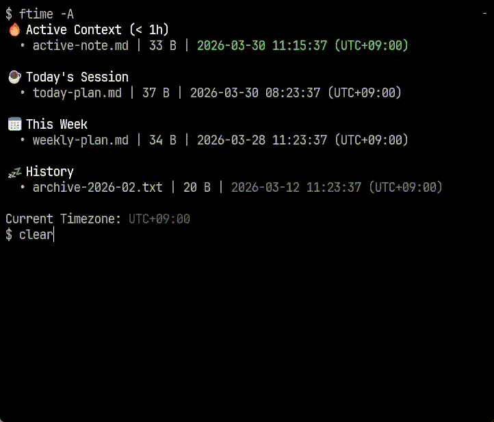

# `ftime` = files by time

English | [日本語](docs/README-ja.md) | [中文](docs/README-zh.md)

`ftime` is a read-only CLI for answering one question quickly:

> What changed in this folder recently?

The name stands for `files by time`. It scans only the first level of a directory, sorts entries by `mtime`, and groups them into time buckets so you can see recent changes without recursive noise.

[](https://github.com/tsutomu-n/ftime/actions/workflows/release.yml)

[](assets/demo_ftime.mp4)

- Read-only by design: no delete, rename, or write operations
- Depth-1 only: see the current folder, not the whole tree
- Buckets: `Active` / `Today` / `This Week` / `History`
- Human-readable sizes in TTY output; plain text and JSON Lines available for scripts

## Why `ftime`?

Use it when you want to:

- clean up `~/Downloads`
- check build output in `./target`
- inspect a log or sync folder
- answer "did anything change here?" in seconds

## Common examples

```bash
ftime
ftime ~/Downloads
ftime ./target
ftime /var/log/app
ftime --exclude-dots
ftime --json | jq -r '.path'
```

`--json` emits one JSON object per line, so it works well with `jq` and other scripts.

## Example output

```text
Active
  • Cargo.toml | 2.1 KiB | 12s ago
Today
  • README.md | 8.4 KiB | 2h ago
This Week
  • docs/ | - | 3d ago [child: today]
History
  • target/ | - | 2w ago [child: active]
```

Directories show `-` in the size column.
Directory rows may show a child activity hint when a direct child is more recent than the directory itself. This hint is TTY-only and never appears in plain text or JSON Lines output.

## Tool fit

| Tool | Strong at | Where `ftime` differs |
| --- | --- | --- |
| `ls -lt` | quick sorted listing | no recency buckets |
| `eza` | rich file listing with metadata | no built-in time buckets |
| `fd` | recursive search and filters | recursive by design |
| `bat` | reading file contents | not a folder activity view |
| `ftime` | recent activity in one folder | buckets + size at a glance |

## Install

### GitHub Releases (recommended)

Fetches the latest published installer from GitHub Releases. This installs the latest published release, not unreleased `main`.
Rust is not required for the GitHub Releases installer.

#### macOS / Linux

```bash
curl -fsSL https://github.com/tsutomu-n/ftime/releases/latest/download/ftime-install.sh | bash
```

#### Windows (PowerShell)

```bash
powershell -ExecutionPolicy Bypass -Command "iwr https://github.com/tsutomu-n/ftime/releases/latest/download/ftime-install.ps1 -UseBasicParsing | iex"
```

Default Windows install dir: `%LOCALAPPDATA%\Programs\ftime\bin`.

Windows installer currently targets x86_64 / AMD64.

### crates.io

Uses the published crate from crates.io.

```bash
cargo install ftime --locked
ftime --version
```

### From source (for unreleased main)

Requires Rust/Cargo 1.92+.

```bash
cargo install --path . --force
hash -r
ftime --version
```

Uninstall steps are documented in `## Uninstall`, including custom install directories.

Common flags:

- `-a, --all`: expand `History` in TTY mode
- `-A, --absolute`: show absolute local timestamps like `2026-03-16 20:49:28 (UTC+09:00)`
- `--exclude-dots`: hide dotfiles
- `--json`: emit one JSON object per line for scripts
- `--check-update`: report whether a newer published release is available
- `--self-update`: update the current installed binary to the latest published release
- `--no-ignore`: disable built-in and file-based ignore rules

## Update

```bash
ftime --check-update
ftime --self-update
```

Typical output:

```text
update available: 1.0.4 -> 1.0.5
ftime updated 1.0.4 -> 1.0.5 in /home/tn/.local/bin
ftime is already up to date at 1.0.4 in /home/tn/.local/bin
ftime now points to 1.0.4 (was 1.0.5) in /home/tn/.local/bin
```

When invoked via a symlink, `ftime --self-update` updates that symlink directory.

If your current binary predates `--self-update`, reinstall once from the latest GitHub Releases installer.

## Uninstall

### GitHub Releases install

#### macOS / Linux

```bash
curl -fsSL https://github.com/tsutomu-n/ftime/releases/latest/download/ftime-uninstall.sh | bash
```

If you installed to a custom directory, pass the same location again:

```bash
curl -fsSL https://github.com/tsutomu-n/ftime/releases/latest/download/ftime-uninstall.sh | env INSTALL_DIR=/custom/bin bash
```

#### Windows PowerShell

```powershell
powershell -ExecutionPolicy Bypass -Command "iwr https://github.com/tsutomu-n/ftime/releases/latest/download/ftime-uninstall.ps1 -UseBasicParsing | iex"
```

```powershell
powershell -ExecutionPolicy Bypass -Command "& ([scriptblock]::Create((iwr https://github.com/tsutomu-n/ftime/releases/latest/download/ftime-uninstall.ps1 -UseBasicParsing).Content)) -InstallDir 'C:\custom\bin'"
```

### `cargo install` / `cargo install --path .`

```bash
cargo uninstall ftime
```

## Learn More

- [日本語](docs/README-ja.md)
- [中文](docs/README-zh.md)
- [Japanese docs router](docs/ftime-overview-ja.md)
- [User guide (Japanese)](docs/USER-GUIDE-ja.md)
- [CLI contract](docs/CLI.md)

## License

MIT (see `LICENSE`)
