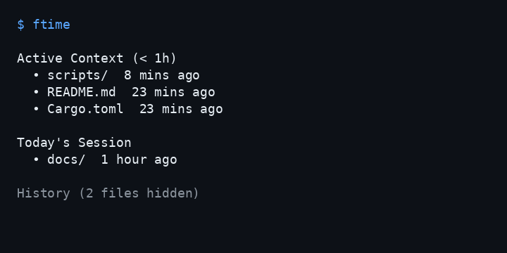

# ftime

English | [日本語](docs/README-ja.md) | [中文](docs/README-zh.md)


A tiny, read-only CLI that lists recently modified files and directories in time buckets (depth 1).



[](https://github.com/tsutomu-n/ftime/actions/workflows/release.yml)

## Features
- 4 time buckets by `mtime`: Active (<1h) / Today / This Week (<7d) / History
- TTY output: color + buckets, History collapsed only when it exceeds 20 items, file sizes, optional absolute timestamps, bucket-aware time heatmap, `Skew` warning for future mtimes, timezone footer
- Pipe/redirect output: tab-separated plain text with 2 columns (`path<TAB>time`)
- JSON Lines: `--json` (default build), with optional `size` for regular files
- Filters: `--ext`, ignore rules (`~/.ftimeignore`, `<PATH>/.ftimeignore`, `FTIME_IGNORE`, `--no-ignore`)

## Quickstart
```bash
ftime
```

## Install
### GitHub Releases (recommended)
Installs the latest published release. This path does **not** install unreleased `main`.

```bash
# macOS / Linux
curl -fsSL https://raw.githubusercontent.com/tsutomu-n/ftime/main/scripts/install.sh | bash

# Windows (PowerShell)
powershell -ExecutionPolicy Bypass -Command "iwr https://raw.githubusercontent.com/tsutomu-n/ftime/main/scripts/install.ps1 -UseBasicParsing | iex"
```

### crates.io (when published)
```bash
cargo install ftime
```

### From source (developer / unreleased main)
Requires Rust/Cargo 1.92+ (edition 2024).

```bash
cargo install --path . --force
hash -r
ftime --version
```

> `cargo build --release` only builds `target/release/ftime` and does not add it to your `PATH`.

Use this path when you want the current checkout instead of the latest release.

## Uninstall
### GitHub Releases install
```bash
# macOS / Linux
curl -fsSL https://raw.githubusercontent.com/tsutomu-n/ftime/main/scripts/uninstall.sh | bash

# Windows (PowerShell)
powershell -ExecutionPolicy Bypass -Command "iwr https://raw.githubusercontent.com/tsutomu-n/ftime/main/scripts/uninstall.ps1 -UseBasicParsing | iex"
```

If you installed to a custom directory, pass the same location again. Use `INSTALL_DIR` on macOS / Linux and `-InstallDir` on Windows:

```bash
curl -fsSL https://raw.githubusercontent.com/tsutomu-n/ftime/main/scripts/uninstall.sh | env INSTALL_DIR=/custom/bin bash
```

```powershell
powershell -ExecutionPolicy Bypass -Command "& ([scriptblock]::Create((iwr https://raw.githubusercontent.com/tsutomu-n/ftime/main/scripts/uninstall.ps1 -UseBasicParsing).Content)) -InstallDir 'C:\custom\bin'"
```

### cargo install / cargo install --path .
```bash
cargo uninstall ftime
```

## Usage
```bash
ftime [OPTIONS] [PATH]
```

Common options:
- `-a, --all`     Show History bucket (TTY mode)
- `-A, --absolute` Show absolute local timestamps (`YYYY-MM-DD HH:MM:SS ±HHMM`)
- `--exclude-dots` Exclude dotfiles
- `--ext rs,toml` Filter by extensions (files only)
- `--json`        JSON Lines output (if built with default features)
- `--no-ignore`   Disable ignore rules
- `--no-labels`   Disable best-effort labels (e.g. Fresh)

TTY notes:
- Time colors follow bucket recency in TTY (`Active` strongest, `History` dimmest)
- Future mtimes are shown as `+Ns [Skew]` or `+Nm [Skew]`
- TTY output ends with `Current Timezone: ±HHMM`

## Docs
- Japanese README: `docs/README-ja.md`
- Chinese README: `docs/README-zh.md`
- User guide (Japanese): `docs/USER-GUIDE-ja.md`
- CLI contract: `docs/CLI.md`

## License
MIT (see `LICENSE`)
