# ftime SVG デモ録画ガイド

> **目的**: README.md用の4本のSVGデモを作成し、ユーザーが一目でftimeの機能を理解できるようにする

---

## 📋 事前準備チェックリスト

### 1. 必要ツールのインストール確認

```bash
# 1) asciinema
asciinema --version
# なければ: sudo apt install asciinema

# 2) Node.js (npx用)
npx --version
# なければ: sudo apt install nodejs npm

# 3) svg-term-cli (初回のみ)
npx -y svg-term-cli --help
# 初回はダウンロードに時間がかかります

# 4) svgo (初回のみ)
npx -y svgo --help
```

### 2. 作業ディレクトリの準備

```bash
# プロジェクトルートに移動
cd /home/tn/projects/ftime

# mediaディレクトリの存在確認
ls -la media/
# なければ: mkdir -p media

# ftime動作確認
./ftime-list.sh --help | head -3
./ftime-list.sh | head -3
```

### 3. 端末環境の設定

```bash
# 端末サイズを固定 (録画の一貫性のため)
resize -s 30 100
# またはターミナルウィンドウを手動で調整

# 現在のサイズ確認
echo "行数: $(tput lines), 列数: $(tput cols)"
# 推奨: 28-32行, 90-100列

# フォント確認 (等幅フォントを使用)
echo "abcdefghijklmnopqrstuvwxyz0123456789"
echo "ABCDEFGHIJKLMNOPQRSTUVWXYZ!@#$%^&*()"
```

---

## 🎬 録画手順 (4シナリオ)

### シナリオ1: Basic List

**目的**: 基本的なファイル一覧表示を示す

```bash
# 録画開始
asciinema rec basic.cast

# === 以下を録画内で実行 ===
# 1. 基本的なファイル一覧表示
./ftime-list.sh .

# 2. 2-3秒待機してから録画終了
exit
```

**期待する表示**:
```
Legend (tz:local): '-' = unknown created time
modified: last updated    created: created time
modified     created      name
08/28_15:31  08/28_15:31  ftime-list.sh
08/28_14:48  08/28_11:38  README.md
...
```

### シナリオ2: Pattern Filters

**目的**: パターンフィルタリングの便利さを示す

```bash
# 録画開始
asciinema rec pattern.cast

# === 以下を録画内で実行 ===
# 1. Markdownファイルのみ
./ftime-list.sh md

# 2. 1秒待機

# 3. ログファイルのみ (もしあれば)
./ftime-list.sh .log

# 4. 1秒待機

# 5. 複数パターン (md と py)
./ftime-list.sh md py

# 6. 2秒待機してから終了
exit
```

### シナリオ3: Directory Target

**目的**: 別ディレクトリ指定の使い方を示す

```bash
# 録画開始
asciinema rec dir.cast

# === 以下を録画内で実行 ===
# 1. mediaディレクトリのmdファイル (なければ .ディレクトリ)
./ftime-list.sh media
# または
./ftime-list.sh . md

# 2. 2秒待機してから終了
exit
```

### シナリオ4: Timezone Override

**目的**: タイムゾーン変更機能を示す

```bash
# 録画開始
asciinema rec tz.cast

# === 以下を録画内で実行 ===
# 1. ローカルタイムゾーン
./ftime-list.sh . | head -4

# 2. 1秒待機

# 3. 東京タイムゾーン
FTL_TZ=Asia/Tokyo ./ftime-list.sh . | head -4

# 4. 2秒待機してから終了
exit
```

---

## 🔄 変換手順

### .cast → .svg 変換

```bash
# 4つのファイルを順次変換
npx -y svg-term --cast basic.cast --out media/basic.svg --window --no-cursor
npx -y svg-term --cast pattern.cast --out media/pattern.svg --window --no-cursor
npx -y svg-term --cast dir.cast --out media/dir.svg --window --no-cursor
npx -y svg-term --cast tz.cast --out media/tz.svg --window --no-cursor

# 変換結果確認
ls -la media/*.svg
```

### .svg → .svg 最適化

```bash
# SVGファイル最適化
npx -y svgo --multipass -o media/basic.svg media/basic.svg
npx -y svgo --multipass -o media/pattern.svg media/pattern.svg
npx -y svgo --multipass -o media/dir.svg media/dir.svg
npx -y svgo --multipass -o media/tz.svg media/tz.svg

# 最適化結果確認
ls -la media/*.svg

# ファイルサイズ比較
echo "=== 最適化前後のサイズ比較 ==="
du -h media/basic.svg media/basic.svg
du -h media/pattern.svg media/pattern.svg
du -h media/dir.svg media/dir.svg
du -h media/tz.svg media/tz.svg
```

---

## ✅ 品質チェック項目

### 1. 録画内容の確認

各.castファイルを再生して内容確認:

```bash
# 録画内容を確認 (オプション)
asciinema play basic.cast
asciinema play pattern.cast
asciinema play dir.cast
asciinema play tz.cast
```

### 2. SVG表示確認

ブラウザでSVGファイルを開いて確認:

```bash
# Firefoxで確認 (例)
firefox media/basic.svg
firefox media/pattern.svg
firefox media/dir.svg
firefox media/tz.svg
```

**確認ポイント**:
- [ ] 文字が読みやすい
- [ ] 列の整列が正しい
- [ ] 色分けが適切
- [ ] 4-8秒程度の適切な長さ
- [ ] legend表示 (`tz:local`, `tz:Asia/Tokyo`)

---

## 📝 README.md への貼り付け

### 貼り付け場所

`## Usage` セクションの直前 (## Demo セクション内) に追加:

### HTML形式 (推奨)

README.mdの該当箇所を以下で更新:

```html
<p align="left">
  
</p>
<p align="left">
  
</p>
<p align="left">
  
</p>
<p align="left">
  
</p>
```

---

## 🚨 トラブルシューティング

### 問題1: 録画が途中で止まる

```bash
# 解決策: tmuxやscreenを使用
tmux new-session -d -s recording
tmux attach -t recording
# この中で録画実行
```

### 問題2: SVG変換でエラー

```bash
# Node.jsバージョン確認
node --version
# v14以上推奨

# キャッシュクリア
npm cache clean --force
```

### 問題3: 列が崩れて表示される

```bash
# 端末幅を固定
export COLUMNS=100
export LINES=30

# 再録画
```

### 問題4: 色が表示されない

```bash
# 強制的に色を有効化
export FTL_FORCE_COLOR=1
./ftime-list.sh .
```

### 問題5: ファイルが重すぎる

```bash
# より短い録画時間で再録画
# または追加最適化
npx -y svgo --multipass --config='{"plugins": [{"name": "removeViewBox", "active": false}]}' -o output.svg input.svg
```

---

## 📁 作業完了後のクリーンアップ

```bash
# .castファイルを削除 (オプション)
# rm *.cast

# 作業結果確認
echo "=== 作成されたファイル ==="
ls -la media/*.svg

echo "=== 合計サイズ ==="
du -sh media/*.svg | awk '{sum+=$1} END {print "Total: " sum "K"}'

echo "=== README.mdの更新忘れチェック ==="
grep -n "media/.*\.min\.svg" README.md || echo "⚠️  README.mdにSVGが貼り付けられていません"
```

---

## 🎯 最終確認

すべて完了したら以下を確認:

- [ ] 4つの.svgファイルが生成されている
- [ ] README.mdに4つのSVGが貼り付けられている
- [ ] ブラウザでSVGが正しく表示される
- [ ] 各SVGが4-8秒程度の適切な長さ
- [ ] gitでコミットする準備ができている

```bash
# 最終確認コマンド
echo "✅ SVGデモ作成完了!"
echo "📁 作成されたファイル数: $(ls media/*.svg 2>/dev/null | wc -l)/4"
echo "📝 README.md更新状況: $(grep -c "media/.*\.min\.svg" README.md)/4"
echo "🎬 作業完了!"
```